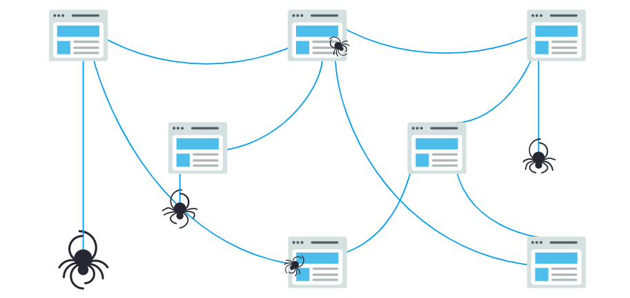
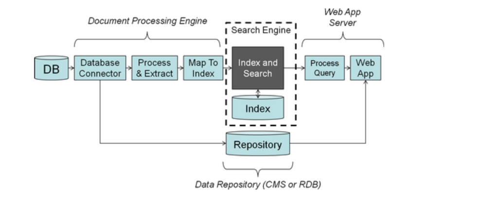

# SEARCH-ENGINE DATABASE

---

### What is a search-engine database?

A search-engine database is a type of nonrelational database that is dedicated to the search of data content. Search-engine databases use indexes to categorize the similar characteristics among data and facilitate search capability. Search-engine databases are optimized for dealing with data that may be long, semistructured, or unstructured, and they typically offer specialized methods such as full-text search, complex search expressions, and ranking of search results. 
 
 https://aws.amazon.com/es/nosql/search/

---

### How is a search-engine database different from a relational database?

 Search engines deal with data that does not conform to the rigid structural requirements of relation databases. Data for search may be long, semi-structured or unstructured. A search engine is primarily an index and not that great as repository for data storage. Further, the “RDBMS ecosystem” (development tools, processes, techniques, typical approaches to solutions, etc.) are generally not that useful for search engines. 
 
https://www.forbes.com/sites/metabrown/2018/03/31/get-the-basics-on-nosql-databases-search-engine-databases/#2607f14515b5

---

### Features of a search-engine database

- Support for complex search expressions
- Full text search
- Stemming (reducing inflected words to their stem)
- Ranking and grouping of search results
- Geospatial search
- Distributed search for high scalability

https://db-engines.com/en/article/Search+Engines

***
### Use cases

**Text search**

Search-engine databases can handle full-text search faster than relational databases. For example, an e-commerce website can use search-engine databases to provide instant autocompletes or suggestions for its customers. Search-engine databases can sort relevant results based on characteristics such as name, price, category, or release data, and display the results in a structured view. 

**Logging and analysis**

Maintaining larger applications that are either distributed across several nodes or consist of several smaller applications searching for events in log files can become tedious. Search-engine databases can handle the logging more efficiently. You can centralize your logs from different applications by indexing them using a search-engine database. For example you can see the logs of your Apache web server combined with the log files of your application server. Because all the information is available in real time, you can implement a visual representation of what is happening in your system in real time, which can help you to find problems more quickly. 

https://aws.amazon.com/es/nosql/search/

---

### Primary functions 

- **Crawl**: Scour the Internet for content, looking over the code/content for each URL they find.
- **Index**: Store and organize the content found during the crawling process. Once a page is in the index, it’s in the running to be displayed as a result to relevant queries.
- **Rank**: Provide the pieces of content that will best answer a searcher's query, which means that results are ordered by most relevant to least relevant.

---

#### What is search engine crawling?

Crawling is the discovery process in which search engines send out a team of robots (known as crawlers or spiders) to find new and updated content. Content can vary — it could be a webpage, an image, a video, a PDF, etc. — but regardless of the format, content is discovered by links.

---

#### What is a search engine index?

Search engines process and store information they find in an index, a huge database of all the content they’ve discovered and deem good enough to serve up to searchers.

---

#### What is search engine ranking?

When someone performs a search, search engines scour their index for highly relevant content and then orders that content in the hopes of solving the searcher's query. This ordering of search results by relevance is known as ranking. In general, you can assume that the higher a website is ranked, the more relevant the search engine believes that site is to the query.

https://moz.com/beginners-guide-to-seo/how-search-engines-operate

---

### Integration of a search engine 

The search engine does indexing and search, and other parts of the application are handled using more appropriate tools:

- **Document Processing Engine**: For content acquisition and metadata normalization. These tools can handle high volume document processing, parsing, extraction, and other tasks. They tend to be much more flexible and have easier deployment strategies than putting this into the search engine itself.
- **Repository**: Search engines are not good at document or data storage. An outside database (Content Management System and/or Relational Database) would better serve this function.
- **Web Application Server**: The end-user application tools provided by search engines are fine for simple user interfaces, but will likely disappoint for most UI customization tasks. Most users quickly outgrow these tools.

## SEARCH-ENGINES

|            |Elasticsearch | Solr | Sphinix |
|----------- |--------------|------|---------|
|Use example | The speed and scalability of Elasticsearch and its ability to index many types of content mean that it can be used for a number of use cases:Application search, Website search, Enterprise search, Logging and log analytics, Infrastructure metrics and container monitoring, Application performance monitoring, Geospatial data analysis and visualization, Security analytics, Business analytics | Providing distributed indexing, replication and load-balanced querying, automated failover and recovery, centralized configuration Solr is designed for scalability and fault tolerance. Solr is widely used for enterprise search and analytics use cases | Sphinx can be used either as a stand-alone server or as a storage engine ("SphinxSE") for the MySQL family of databases. When run as a standalone server Sphinx operates similar to a DBMS and can communicate with MySQL, MariaDB and PostgreSQL through their native protocols or with any ODBC-compliant DBMS via ODBC. MariaDB, a fork of MySQL, is distributed with SphinxSE.|
|License|Parts of the software are licensed under various open-source licenses (mostly the Apache License), while other parts fall under the proprietary (source-available) Elastic License.|Licensed under the Apache License, Version 2.0.|The Sphinx Search server is dual-licensed; thus it can be either commercially licensed or freely available via the Downloads page if used in accordance with the terms of the GPL v.2.||Pricing|Free|Free|Free|
|Projects using it|Github|AT&T, Instagram,Buy.com, Ticketmaster, Netflix, The Echo Nest, Chegg, Disney, Adobe, eBay, IBM Websphere Commerce, Bloomberg, Comcast, MTV Networks, Travelocity|Craigslist.org, Recruitment.aleph-graymatter.com, Tradebit.com, vBulletin.com, Mediawiki Extension, Boardreader.com, OMBE.com, Limundo.com|
|Latest version| 6.8.10, June 2020|8.5.2, May 2020|Sphinx 3.2.1 (f152e0b; Jan 31, 2020)|
|Initial release date|February 2010|September 2008|2001|
|Consistency|Read consistency is eventually consistent but it can also be consistent|Eventual consistency||
|Data representation|JSON|JSON, XML, CSV or binary results|XML|
|Development Language|Java|Java|C++|
|API language|HTTP|HTTP|If Sphinx run as a stand-alone server, it is possible to use SphinxAPI to connect an application to it.|
|Features|Data rollups, index lifecycle management, Distributed search, Multi-tenancy, An analyzer chain, Analytical search, Grouping & aggregation|Full-text search, hit highlighting, faceted search, real-time indexing, dynamic clustering, database integration, NoSQL features and rich document (e.g., Word, PDF) handling|Batch and incremental (soft real-time) full-text indexing, Support for non-text attributes (scalars, strings, sets, JSON), Direct indexing of SQL databases. Native support for MySQL, MariaDB,PostgreSQL, MSSQL, plus ODBC connectivity, XML document indexing support, Full-text searching syntax, Database-like result set processing, Relevance ranking utilizing additional factors besides standard BM25|

